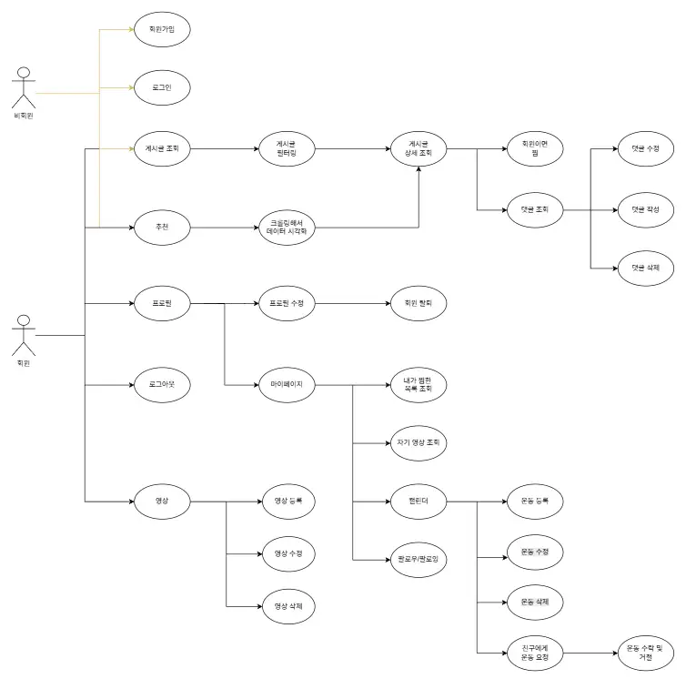

# 🧗 꿀멩이

## 📌 프로젝트 소개

**꿀멩이**는 클라이밍 입문자 및 애호가를 위한 통합 플랫폼입니다.  
게시물 기반 학습 콘텐츠를 등록 및 공유할 수 있으며, 댓글, 좋아요, 팔로우 등 **커뮤니티 기능**을 통해 사용자 간 소통을 지원합니다.  

## 📃 기능 요구사항

| ID   | 분류       | 기능명                          | 기능 설명                                                                      |
|------|-----------|---------------------------------|--------------------------------------------------------------------------------|
| F01  | 회원      | 회원가입                        | 이메일/비밀번호, 닉네임 등의 정보로 신규 회원을 등록하는 기능                    |
| F02  | 회원      | 회원 조회                       | 회원 프로필 및 활동 내역을 조회하는 기능                                        |
| F03  | 회원      | 닉네임 중복 확인                | 입력한 닉네임의 중복 여부를 확인하는 기능                                        |
| F04  | 회원      | 이메일 중복 확인                | 입력한 이메일의 중복 여부를 확인하는 기능                                        |
| F05  | 회원      | 회원 정보 수정                  | 사용자가 본인 프로필 정보를 수정하는 기능                                         |
| F06  | 회원      | 회원 탈퇴                       | 사용자가 서비스 탈퇴 시 개인정보를 안전하게 삭제/비활성화하는 기능                 |
| F07  | 인증      | 로그인                          | 이메일/비밀번호로 로그인하고 액세스·리프레시 토큰을 발급받는 기능                 |
| F08  | 인증      | 로그아웃                        | 리프레시 토큰을 삭제하여 세션을 종료하는 기능                                      |
| F09  | 인증      | 토큰 갱신                       | 유효한 리프레시 토큰으로 새로운 액세스 토큰을 발급받는 기능                        |
| F10  | 인증      | 비밀번호 확인                   | 비밀번호 변경 전 사용자 비밀번호 일치 여부를 확인하는 기능                         |
| F11  | 인증      | 비밀번호 변경                   | 인증된 사용자의 비밀번호를 새로운 값으로 변경하는 기능                            |
| F12  | 게시물    | 게시물 등록                     | 게시물 정보를 등록하는 기능                                                     |
| F13  | 게시물    | 게시물 조회                     | 게시물을 조회하는 기능 (필터링 포함)                                           |
| F14  | 게시물    | 게시물 수정                     | 게시물 정보를 수정하는 기능                                                     |
| F15  | 게시물    | 게시물 삭제                     | 게시물 정보를 삭제하는 기능                                                     |
| F16  | 게시물    | 게시물 검색                     | 지점, 난이도, 인기순 등으로 정렬 및 검색할 수 있는 기능                         |
| F17  | 게시물    | 찜 게시물                       | 관심 있는 게시물을 찜 목록에 추가·제거하고, 찜 목록을 조회할 수 있는 기능        |
| F18  | 댓글      | 댓글 작성                       | 게시물에 대한 댓글을 작성하는 기능                                              |
| F19  | 댓글      | 댓글 조회                       | 게시물에 대한 댓글을 조회하는 기능                                              |
| F20  | 댓글      | 댓글 수정                       | 게시물에 대한 댓글을 수정하는 기능                                              |
| F21  | 댓글      | 댓글 삭제                       | 게시물에 대한 댓글을 삭제하는 기능                                              |
| F22  | 마이페이지 | 내가 작성한 게시물 조회         | 로그인한 사용자가 본인이 작성한 게시물을 한눈에 확인할 수 있는 기능               |
| F23  | 마이페이지 | 내가 찜한 게시물 조회           | 로그인한 사용자가 찜한 게시물을 한눈에 확인할 수 있는 기능                      |
| F24  | 지점추천  | 추천 데이터 조회               | 알고리즘 기반으로 추천된 지점 정보를 조회할 수 있는 기능                         |

## 🔗 USE CASE

## 😊 멤버 소개
❤️ 김선민
💚 추수연 
